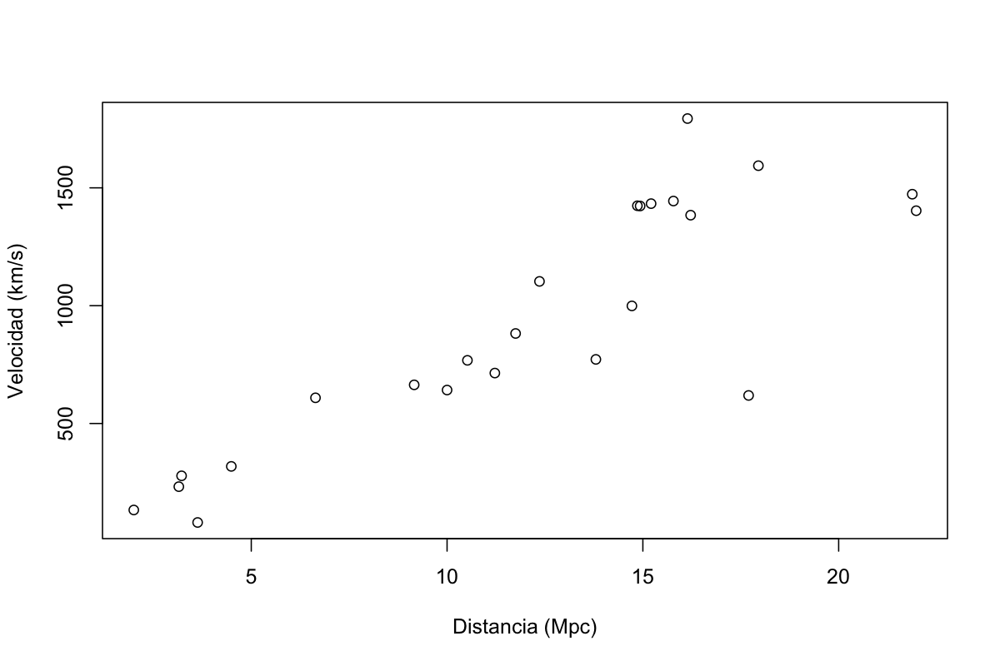
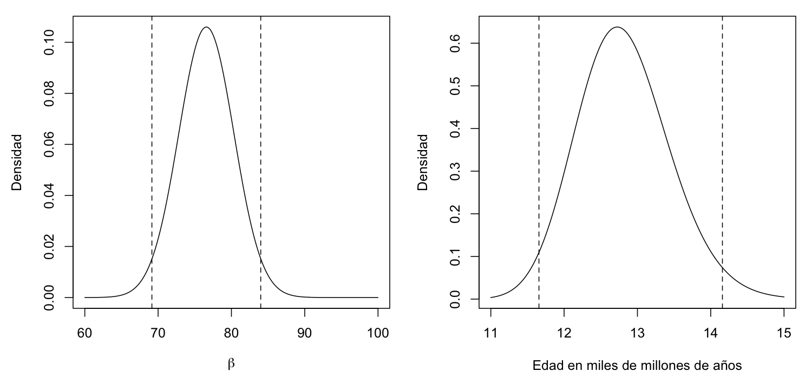

# Introducción

INLA puede ser bastante complejo, por lo que comenzaremos con un ejemplo sencillo de regresión para ilustrar sus características más básicas. No pretendemos ofrecer una introducción exhaustiva a los métodos bayesianos. En cambio, repasaremos la teoría bayesiana que aparecerá más adelante en el libro. También explicaremos por qué podría preferirse INLA frente a sus alternativas.

## Inicio rápido

### Ley de Hubble

Comencemos a trabajar con INLA mediante un ejemplo sencillo. Supongamos que queremos conocer la edad del universo. Al principio ocurrió el *big bang*. Las galaxias se alejaron del centro del universo a velocidad constante. Si medimos la velocidad de otras galaxias respecto de nosotros y su distancia hasta nosotros, podemos estimar la edad del universo. Usamos la ley de Hubble, que establece:

$$
y = \beta x,
$$

donde $y$ es la velocidad relativa entre nosotros y otra galaxia, y $x$ es la distancia desde nosotros hasta esa galaxia. A $\beta$ se le denomina constante de Hubble. Podemos estimar la edad del universo como $\beta^{-1}$.

El telescopio espacial Hubble ha permitido reunir los datos indispensables para responder esta pregunta. Utilizamos datos de 24 galaxias presentados por @freedman2001. Los mismos datos también se analizan en @wood2006. Consulte el apéndice A de la edición original para instalar INLA y el paquete R del libro. Los datos se encuentran en dicho paquete, llamado `brinla`.

```{r}
data(hubble, package = "brinla")
```

A lo largo del libro resaltamos el código R de esta manera. Puede escribirlo en la consola de R o copiarlo desde los guiones de cada capítulo. También puede acceder a los datos y funciones mediante `library(brinla)`. Hemos preferido `data()` para dejar clara la procedencia de los datos.

Graficamos los datos como se muestra en la @fig-hubble-datos.

{#fig-hubble-datos width=85%}

Observamos que los puntos no están todos sobre una recta, por lo que debe existir algún error de medición. Esto no sorprende, dada la dificultad de observar objetos tan lejanos. Aun así, se aprecia una relación aproximadamente lineal entre las variables, congruente con la ley de Hubble. Incorporamos el error mediante el modelo

$$
y_i=\beta x_i+\varepsilon_i, \qquad i=1,\ldots,24.
$$

Por ahora solo suponemos que los errores tienen media cero y varianza $\sigma^2$.

### Análisis estándar

El método de mínimos cuadrados tiene ya casi 200 años y puede aplicarse para estimar $\beta$. El modelo no contiene intercepto, por lo que incluimos `-1` en su fórmula.

```{r}
lmod <- lm(y ~ x - 1, data = hubble)
coef(lmod)
```

```{.text}
     x
76.581
```

Esta es nuestra estimación de $\beta$, la constante de Hubble. Debemos convertir las unidades de los datos a una forma más conveniente. Hay 60 segundos por minuto, 60 minutos por hora, 24 horas por día y 365.25 días por año; un megapársec (Mpc) equivale a $3.09\times10^{19}$ km. La siguiente función transforma la constante de Hubble en la edad del universo, expresada en miles de millones de años, y la aplicamos a nuestra estimación:

```{r}
hubtoage <- function(x) 3.09e+19/(x * 60^2 * 24 * 365.25 * 1e+09)
hubtoage(coef(lmod))
```

```{.text}
     x
12.786
```

La estimación puntual de la edad del universo es de 12.8 miles de millones de años. Sabemos que existe incertidumbre y quizá deseemos expresarla mediante un intervalo de confianza. Para ello necesitamos una suposición distribucional sobre los errores: suponemos que siguen una distribución gaussiana. Hay otras suposiciones. Consideramos correcta la forma estructural del modelo, con base en la ley de Hubble y en el aparente respaldo de los datos. También hemos supuesto que los errores tienen varianza constante. Puede que esto no sea completamente cierto, pero lo aceptaremos para mantener la sencillez.

Construimos un intervalo de confianza del 95 % para la constante de Hubble:

```{r}
(bci <- confint(lmod))
```

```{.text}
   2.5 % 97.5 %
x 68.379 84.783
```

El intervalo es bastante amplio. Podemos transformarlo a un intervalo para la edad del universo:

```{r}
hubtoage(bci)
```

```{.text}
  2.5 % 97.5 %
x 14.320 11.549
```

La inversión necesaria para calcular la edad cambia el orden de los límites. El intervalo de confianza del 95 % va de 11.5 a 14.3 miles de millones de años.

### Análisis bayesiano

Podríamos darnos por satisfechos con el análisis anterior: tenemos una estimación puntual y una expresión de su incertidumbre. Sin embargo, al examinar los resultados con mayor detenimiento quizá sintamos cierta insatisfacción y estemos dispuestos a considerar otro método.

Resulta tentador interpretar el intervalo de confianza como una afirmación de que existe un 95 % de probabilidad de que la edad del universo esté entre 11.5 y 14.3 miles de millones de años. Pero esto no es en absoluto lo que sostiene la teoría utilizada para construirlo. Esta teoría —denominada a veces frecuentista y otras veces inferencia clásica— considera que los parámetros son cantidades fijas, aunque por lo general desconocidas. Por ello, dentro de esta teoría carece de sentido asignar probabilidades a los parámetros. El 95 % de confianza se refiere al intervalo, no al parámetro: se afirma que el procedimiento produce intervalos que cubren el verdadero valor del parámetro en el 95 % de los casos.

Podría objetarse que los datos ya se observaron y se conocen, por lo que el intervalo dejó de ser aleatorio. Para responder hay que construir un argumento más elaborado. Imaginamos un número ilimitado de universos alternativos cuyas galaxias se generan según el modelo lineal anterior. Para cada universo calculamos un intervalo de confianza del mismo modo. En el 95 % de esos universos, el intervalo contendrá la verdadera edad del universo.

La mayoría de las personas no se detiene en esta peculiar naturaleza del intervalo de confianza y lo interpreta como una afirmación probabilística sobre la edad del universo. En la práctica, esto casi nunca importa demasiado, aunque en ocasiones sí marca una diferencia.

En la estadística bayesiana consideramos aleatorios los parámetros. Antes de ajustar el modelo expresamos nuestra incertidumbre mediante una probabilidad previa. Después usamos el teorema de Bayes para calcular una probabilidad posterior sobre los parámetros, combinando la previa con la verosimilitud de los datos bajo el modelo. Más adelante explicaremos exactamente cómo se hace. Este método permite formular afirmaciones probabilísticas directas sobre la edad del universo y ofrece otras ventajas.

### INLA

Los cálculos bayesianos suelen ser mucho más difíciles que los frecuentistas. Esta es la razón principal por la que, históricamente, los métodos clásicos se prefirieron a los bayesianos. Ahora que la computación es potente y económica, podemos realizar esos cálculos con mayor facilidad. En unos cuantos modelos sencillos, como el ejemplo de Hubble, los cálculos pueden hacerse de manera exacta. En problemas más complejos debemos escoger entre dos clases de metodología computacional: simulación o aproximación.

INLA, siglas de *Integrated Nested Laplace Approximation*, es un método de aproximación. Veamos cómo funciona en el ejemplo de Hubble. Primero cargamos el paquete:

```{r}
library(INLA)
```

Para ajustar un modelo bayesiano debemos especificar algo más que su forma estructural, aquí `y ~ x - 1`; `-1` indica que debe omitirse el intercepto, incluido por defecto. También debemos especificar las distribuciones previas de los parámetros. En este modelo tenemos dos: $\beta$ y $\sigma$. En ocasiones podemos confiar en la opción predeterminada, que procura ser no informativa; así lo haremos para $\sigma$. Los valores predeterminados y la elección de previas se estudiarán con detalle más adelante. Por ahora nos concentraremos en $\beta$.

INLA se aplica a una amplia clase denominada modelos gaussianos latentes. Pertenecer a esta clase exige que ciertos parámetros tengan distribuciones previas gaussianas. Más adelante veremos cuáles deben ser gaussianos; en nuestro modelo necesitamos una previa gaussiana para $\beta$. Por defecto tiene media cero, que conservaremos. INLA suele expresar la dispersión mediante la precisión, inversa de la varianza. Valores grandes representan mucha certeza. Aquí sabemos muy poco, por lo que elegimos una precisión muy pequeña. El significado de «muy pequeña» depende de la escala de los datos. Estandarizarlos puede evitar el problema, pero en este ejemplo exigiría deshacer después la estandarización al calcular la edad. Por ello mantenemos la escala original y elegimos una precisión suficientemente pequeña.

```{r}
imod <- inla(
  y ~ x - 1,
  family = "gaussian",
  control.fixed = list(prec = 1e-09),
  data = hubble
)
```

Primero indicamos la parte estructural con la notación usual de modelos de R. Después fijamos una distribución para la respuesta; elegimos la gaussiana, aunque la respuesta no tiene que ser gaussiana para que el modelo pertenezca a la clase latente gaussiana. Podríamos elegir binomial, Poisson o muchas otras. A continuación especificamos la previa de $\beta$, el parámetro «fijo». Este término resulta algo engañoso en un contexto bayesiano, pues los parámetros no suelen estar fijos; procede de los modelos de efectos mixtos, estudiados en el capítulo 5. Bajo esa terminología igualmente problemática, $\sigma^2$ es el componente aleatorio, para el cual usamos la previa predeterminada. Para $\beta$ conservamos la media predeterminada cero y fijamos una precisión de $10^{-9}$. Finalmente indicamos dónde se encuentran los datos.

El modelo y el conjunto de datos son pequeños, de modo que el cálculo es prácticamente instantáneo. Se obtienen muchas cantidades; aquí nos concentramos en la distribución posterior de $\beta$.

```{r}
(ibci <- imod$summary.fixed)
```

```{.text}
    mean     sd 0.025quant 0.5quant 0.975quant   mode       kld
x 76.581 3.7638     69.152   76.581       84.0 76.581 1.406e-11
```

Se proporcionan varios estadísticos de resumen. `kld` es un diagnóstico de la precisión de la aproximación INLA; valores pequeños, como este, son favorables. Si reproduce el ejemplo, no espere exactamente los mismos números, por razones explicadas en la sección 2.4 de la obra original. También podemos graficar la densidad posterior de $\beta$. Los comandos necesarios para extraer y representar elementos de la salida de INLA pueden ser complejos, por lo que posponemos su explicación.

```{r}
plot(imod$marginals.fixed$x, type = "l", xlab = "beta",
     ylab = "density", xlim = c(60, 100))
abline(v = ibci[c(3, 5)], lty = 2)
```

La densidad posterior expresa nuestra incertidumbre sobre la constante de Hubble después de incorporar los datos de las 24 galaxias. El valor más probable ronda 75 y es improbable que sea menor que 70 o mayor que 90. La media, la mediana y la moda coinciden aquí con la estimación de mínimos cuadrados, 76.581.

Podemos expresar la incertidumbre mediante un intervalo que contenga el 95 % de la probabilidad. Una forma sencilla consiste en usar los percentiles 2.5 y 97.5, que producen $[69.2,84.0]$. Se denomina intervalo de credibilidad para distinguirlo de un intervalo de confianza. Ahora sí afirmamos que hay una probabilidad del 95 % de que la constante de Hubble se encuentre dentro del intervalo.

{#fig-hubble-posteriores width=95%}

Los resultados pueden transformarse a la escala de la edad del universo:

```{r}
hubtoage(ibci[c(1, 3, 4, 5, 6)])
```

```{.text}
   mean 0.025quant 0.5quant 0.975quant   mode
x 12.786     14.160   12.786     11.657 12.786
```

Omitimos el error estándar porque transformarlo correctamente requiere más trabajo. La densidad y su intervalo se muestran en la @fig-hubble-posteriores.

```{r}
ageden <- inla.tmarginal(hubtoage, imod$marginals.fixed$x)
plot(ageden, type = "l", xlab = "Age in billions of years",
     ylab = "density")
abline(v = hubtoage(ibci[c(3, 5)]), lty = 2)
```

El intervalo de credibilidad del 95 % va de 11.7 a 14.2 miles de millones de años, ligeramente distinto del intervalo de confianza anterior.

Usamos una previa no informativa, pero podríamos incorporar información previa. Sabemos, por ejemplo, que el universo se expande y esperamos que la constante de Hubble sea positiva. Antes del lanzamiento del telescopio espacial Hubble se pensaba que la edad del universo estaba entre 10 y 20 miles de millones de años. Llevemos esa información a la escala de la constante, recordando que `hubtoage()` funciona en sentido inverso por la naturaleza de la conversión:

```{r}
hubtoage(c(10, 15, 20))
```

```{.text}
[1] 97.916 65.277 48.958
```

Esto sugiere una media previa de, por ejemplo, 65. Supongamos que al expresar la incertidumbre mediante $[a,b]$ se piensa, al menos implícitamente, en un intervalo de confianza o credibilidad del 95 %. Su anchura sería aproximadamente cuatro desviaciones estándar. Como aquí la anchura es 49, resulta razonable comenzar con una desviación estándar cercana a 12.

```{r}
imod <- inla(
  y ~ x - 1,
  family = "gaussian",
  control.fixed = list(mean = 65, prec = 1/(12^2)),
  data = hubble
)
(ibci <- imod$summary.fixed)
```

```{.text}
    mean     sd 0.025quant 0.5quant 0.975quant   mode        kld
x 75.479 3.7292     67.981   75.522     82.729 75.596 1.1216e-11
```

Al convertir a la escala de la edad se obtiene una predicción un poco mayor, pues la media previa de 15 mil millones de años supera la estimación de mínimos cuadrados. Aun así, los resultados no difieren mucho. Preferimos que no sean demasiado sensibles a la elección de previa. Aunque aceptemos su inevitable subjetividad, es deseable coincidir con analistas que elijan otras previas. Con una cantidad razonable de datos, la previa tendrá poco efecto. El teorema de Bernstein--von Mises ofrece cierto respaldo teórico a esta observación empírica [véase @lecam2012].

¿Qué ocurre si la previa contradice por completo a los datos? Según la cronología de Ussher, el universo fue creado el 22 de octubre de 4004 a. C. Otros autores contemporáneos, entre ellos Isaac Newton, discreparon de Ussher, pero sus estimaciones se situaban a unos pocos cientos de años de esa fecha. Bajo dicha cronología, la constante de Hubble sería:

```{r}
(uhub <- hubtoage((2016 + 4004 - 1)/1e+09))
```

```{.text}
[1] 162678504
```

Esto produce un valor enorme. El texto original propone usarlo como media previa y suponer una variación del 5 % en las estimaciones de la edad. Sin embargo, el bloque de código impreso repite por error la previa anterior (`mean = 65`, `prec = 1/(12^2)`); se conserva a continuación para mantener fidelidad documental.

```{r}
imod <- inla(
  y ~ x - 1,
  family = "gaussian",
  control.fixed = list(mean = 65, prec = 1/(12^2)),
  data = hubble
)
(ibci <- imod$summary.fixed)
```

El resultado vuelve a ser muy similar al de la previa no informativa. La distribución normal asigna peso a toda la recta real. Aunque las probabilidades de valores muy alejados de la media sean minúsculas, no son cero, lo que permite que los datos superen una previa inusual.

En algunos casos, la previa puede ser tan incompatible con los datos que surjan dificultades computacionales y resultados extraños. Se habla entonces de conflictos entre datos y previa, aunque también debe considerarse la posibilidad de que el propio modelo sea muy erróneo; véase @evans2006. Antes de explorar más aplicaciones de INLA necesitamos desarrollar algo de teoría.

## Teoría de Bayes

No intentaremos ofrecer aquí una introducción completa a la teoría bayesiana. Remitimos a @gelman2014 y @carlin2008. Solo haremos un recorrido breve por las ideas y métodos necesarios más adelante. Quien ya tenga experiencia bayesiana puede pasar al capítulo siguiente.

Partimos de un modelo paramétrico $p(\mathbf y\mid\boldsymbol\theta)$ para los datos $\mathbf y$, con parámetros $\boldsymbol\theta$. Proponemos el modelo de acuerdo con la estructura de los datos, la información sobre su recolección y el conocimiento de su contexto. Existe incertidumbre sobre los parámetros, que esperamos reducir con los datos, y casi siempre también sobre el propio modelo. Rara vez creemos que sea completamente verdadero; esperamos que constituya una aproximación eficaz a la realidad para el propósito previsto. Por ello es razonable considerar modelos alternativos y comprobar si el elegido resulta adecuado para los datos observados.

En vez de ver $p(\mathbf y\mid\boldsymbol\theta)$ como función de $\mathbf y$, podemos verla como función de $\boldsymbol\theta$. Esta verosimilitud $L(\boldsymbol\theta)$ representa nuestra incertidumbre acerca de $\boldsymbol\theta$, pero es importante entender que no constituye una densidad de probabilidad para ese parámetro.

En el enfoque frecuentista buscamos estimar $\boldsymbol\theta$. La forma natural y más habitual consiste en hallar los valores más verosímiles maximizando $L(\boldsymbol\theta)$; se obtiene así la estimación de máxima verosimilitud (MLE). Esta posee muchas propiedades favorables y permite derivar cantidades útiles como errores estándar e intervalos de confianza. En casos sencillos se calcula explícitamente; por lo general requiere optimización numérica. En muchos modelos comunes estos métodos están bien comprendidos y son eficientes, aunque en modelos más complejos pueden volverse problemáticos. Pese a ello, la principal razón para preferir métodos bayesianos no es computacional, pues suelen ser más lentos: las respuestas de un análisis bayesiano son conceptualmente diferentes.

Para el frecuentismo, $\boldsymbol\theta$ es fijo pero desconocido y los datos sirven para estimarlo. Para el bayesianismo, los parámetros son variables aleatorias. Antes de observar los datos expresamos la incertidumbre mediante una densidad previa $\pi(\boldsymbol\theta)$. Actualizamos esa incertidumbre con los datos y el modelo para producir la densidad posterior $p(\boldsymbol\theta\mid\mathbf y)$. El teorema de Bayes proporciona la transformación:

$$
p(\boldsymbol\theta\mid\mathbf y)
=\frac{p(\mathbf y\mid\boldsymbol\theta)\pi(\boldsymbol\theta)}{p(\mathbf y)}.
$$

En palabras,

$$
\text{Posterior}\ \propto\ \text{Verosimilitud}\times\text{Previa}.
$$

Aunque el concepto es sencillo, debemos calcular la constante normalizadora

$$
p(\mathbf y)=\int p(\mathbf y\mid\boldsymbol\theta)\pi(\boldsymbol\theta)\,d\boldsymbol\theta,
$$

la probabilidad marginal de los datos bajo el modelo. Integrales como esta explican por qué la sencillez conceptual del teorema exige más trabajo del que parece.

## Distribuciones previas y posteriores

Especificar la previa es una parte importante y quizá la más débil de un análisis bayesiano, pues sus críticos pueden cuestionar razonablemente cualquier elección. Cuando las conclusiones son polémicas, defender una previa particular puede ser difícil. Cabe responder que la elección del modelo también suele ser subjetiva y no siempre admite una justificación firme, de modo que un análisis frecuentista tampoco puede pretender objetividad total. Casi todo análisis contiene cierta subjetividad; el enfoque bayesiano simplemente hace explícitas sus decisiones.

La mejor motivación para una previa es el conocimiento sustantivo sobre $\boldsymbol\theta$. A veces procede de la opinión experta, que quizá deba formularse matemáticamente, y otras de experiencias anteriores con datos similares. Incluso puede utilizarse como previa la posterior de un experimento previo. Estas previas se denominan informativas o sustantivas. Si la información está disponible, sin duda debería aprovecharse. Cuando no lo está, necesitamos otra base para decidir.

Una opción especialmente cómoda es la previa conjugada: previa y posterior pertenecen a la misma familia y existe una fórmula explícita para los parámetros posteriores en función de los parámetros previos y los datos. Por ejemplo, para una muestra normal univariada, una previa normal sobre la media —con varianza conocida— produce una posterior normal. Antes de disponer de cómputo rápido, esta elección era muy recomendable. Sin embargo, solo existe para un puñado de modelos sencillos y su conveniencia no constituye una razón sustantiva para preferirla frente a otras alternativas razonables.

Cuando no se dispone de información firme, puede desearse una elección «segura» sin consecuencias fuertes. Ese deseo es comprensible, pero sorprendentemente difícil de satisfacer. La opción aparentemente más directa es la previa plana:

$$
\pi(\boldsymbol\theta)\propto 1.
$$

No favorece en apariencia ningún valor particular, pero no es una densidad propia, salvo que $\boldsymbol\theta$ tenga rango finito, porque no integra a un valor finito. A menudo podemos proceder normalizando la verosimilitud como densidad; a veces el resultado es satisfactorio y otras veces irrazonable. Resulta difícil delimitar exactamente cuándo falla, por lo que conviene ser escéptico ante posteriores derivadas de previas planas.

Además, la planitud depende de la escala. Si $\sigma$ es la desviación estándar y $\sigma^2$ la varianza de una normal, elegir $\pi(\sigma)\propto1$ no equivale a elegir $\pi(\sigma^2)\propto1$. Ser plana en una escala implica ser informativa en otra. Esta falta de invariancia afecta a otros intentos de obtener previas no informativas. Una posible solución es la previa de Jeffreys:

$$
\pi(\boldsymbol\theta)\propto |I(\boldsymbol\theta)|^{1/2}.
$$

Es invariante ante reparametrizaciones, pero produce resultados poco razonables en algunos modelos y no es una solución universal. Las previas objetivas intentan reducir la subjetividad, aunque eliminar el juicio humano parece irreal. En algunas clases de problemas se han consolidado elecciones habituales. Seguirlas protege de ciertas críticas de arbitrariedad, pero pueden ser meras costumbres sin justificación más sólida.

INLA ofrece un menú limitado de previas preprogramadas, aunque permite definir otras. Además, veremos que al menos algunos parámetros están restringidos a una previa gaussiana. Para aquellos donde sí existe elección, @simpson2017 formula principios generales de construcción implementados en INLA.

Aunque una postura bayesiana muy ortodoxa exige elegir la previa una sola vez antes de ver los datos, hay buenas razones para experimentar con alternativas razonables. Si las conclusiones son cualitativamente semejantes, aumenta nuestra confianza; si resultan muy sensibles, debemos moderar nuestras afirmaciones. A esta propiedad se la denomina *sensibilidad a la previa*, y deseamos que sea pequeña.

Las posteriores son menos problemáticas, pues quedan completamente determinadas por la previa y la verosimilitud. No obstante, comprenderlas no siempre es sencillo. $p(\boldsymbol\theta\mid\mathbf y)$ suele ser multivariante y, a veces, de dimensión muy elevada. Como es difícil visualizarla, a menudo examinamos la distribución marginal de un parámetro $\theta_i$:

$$
p(\theta_i\mid\mathbf y)=\int p(\boldsymbol\theta\mid\mathbf y)\,d\boldsymbol\theta_{-i},
$$

donde $\boldsymbol\theta_{-i}$ denota $\boldsymbol\theta$ sin su componente $i$. Esto requiere integración multidimensional. En una normal multivariante es sencillo; en otras situaciones puede ser exigente.

Es buena práctica graficar las posteriores marginales. También pueden resumirse con media, mediana y moda. En distribuciones aproximadamente simétricas apenas difieren; en distribuciones sesgadas conviene entender sus distinciones y observar la densidad. La dispersión puede resumirse mediante la desviación estándar o cuantiles seleccionados.

Los cuantiles 2.5 y 97.5 forman un intervalo de credibilidad del 95 %. A diferencia del intervalo de confianza frecuentista, este sí afirma que el parámetro se encuentra en el intervalo con una probabilidad especificada. Los intervalos de credibilidad no son únicos: los cuantiles son fáciles de calcular, pero también puede buscarse el intervalo más corto que contenga la probabilidad indicada. Se denomina intervalo de máxima densidad posterior (HPD) y puede calcularse con `inla.hpdmarginal()`.

## Comprobación del modelo

La distribución predictiva de una observación futura $z$ es

$$
p(z\mid\mathbf y)=\int p(z\mid\boldsymbol\theta)p(\boldsymbol\theta\mid\mathbf y)\,d\boldsymbol\theta.
$$

Además de servir para predecir, permite comprobar el modelo. La ordenada predictiva condicional (CPO), introducida por @pettit1990, se define como

$$
\operatorname{CPO}_i=p(y_i\mid\mathbf y_{-i}),
$$

donde $\mathbf y_{-i}$ contiene todos los datos salvo la observación $i$. La CPO mide la probabilidad o densidad del valor observado $y_i$; valores especialmente pequeños señalan observaciones inusuales que el modelo no explica bien. Algunas observaciones son tan influyentes que alteran mucho el ajuste; por ello se excluye la propia observación al calcular la CPO. Parecería necesario reajustar el modelo para cada caso, pero existen atajos eficaces que reducen notablemente el costo [@held2010].

La transformación integral de probabilidad (PIT), introducida por @dawid1984, es semejante:

$$
\operatorname{PIT}_i=P(Y_i<y_i\mid\mathbf y_{-i}).
$$

Tiene mayor sentido para una respuesta continua. Con un buen modelo, las PIT del conjunto de datos deberían distribuirse aproximadamente de manera uniforme. Valores cercanos a cero o uno indican observaciones mucho menores o mayores, respectivamente, de lo esperado. INLA también dispone de formas económicas de calcularlas.

## Selección del modelo

A veces debemos elegir entre varios modelos propuestos. Necesitamos entonces un criterio que mida su concordancia con los datos. El más conocido es el criterio de información de Akaike:

$$
\operatorname{AIC}=-2\log p(\mathbf y\mid\widehat{\boldsymbol\theta}_{\mathrm{MLE}})+2k,
$$

donde $k$ es el número de parámetros. Se prefieren valores pequeños. La primera parte mide el ajuste; sin la segunda, los modelos grandes siempre serían favorecidos. La penalización prefiere modelos pequeños. Desde una perspectiva bayesiana hay dos problemas: el criterio se basa en la MLE y el conteo $k$ resulta problemático en modelos jerárquicos, cuyo número efectivo de parámetros no es evidente.

Para modelos bayesianos podemos preferir el criterio de información de la devianza (DIC) de @spiegelhalter2002, inspirado en AIC. Definimos la devianza:

$$
D(\boldsymbol\theta)=-2\log p(\mathbf y\mid\boldsymbol\theta).
$$

En un modelo bayesiano es una variable aleatoria, por lo que usamos la devianza esperada $\bar D=E[D(\boldsymbol\theta)]$ bajo la posterior como medida de ajuste. El número efectivo de parámetros es

$$
p_D=E[D(\boldsymbol\theta)]-D[E(\boldsymbol\theta)]
=\bar D-D(\bar{\boldsymbol\theta}),
$$

y entonces

$$
\operatorname{DIC}=\bar D+p_D.
$$

Se calcula para cada modelo y se elige el menor; véase @spiegelhalter2014. Una alternativa es el criterio de información de Watanabe--Akaike (WAIC) [@watanabe2010], construido con un enfoque más plenamente bayesiano. @gelman2014 sostiene que WAIC es preferible a DIC y explica por qué el denominado criterio de información bayesiano (BIC) no es comparable con los anteriores.

Finalmente, cabe preguntar por qué elegir un solo modelo cuando podemos aprovechar la información de todos. Podemos asignar una probabilidad previa a cada uno, actualizarla a una probabilidad posterior y combinar la información para realizar inferencias o predicciones. Esta idea se denomina promediado bayesiano de modelos [@draper1995].

## Contraste de hipótesis

En el enfoque frecuentista, la hipótesis nula $H_0$ suele ser un solo punto y la alternativa $H_1$, todo lo demás. Se propone un estadístico y se calcula, bajo $H_0$, la probabilidad de observar un valor igual o más extremo que el obtenido: el valor $p$. Aunque se interpreta así con frecuencia, no es la probabilidad de que $H_0$ sea verdadera. La práctica común declara un resultado «estadísticamente significativo» y rechaza $H_0$ si $p<0.05$; si no es pequeño, no se rechaza.

Este procedimiento se denomina contraste de significación de la hipótesis nula (NHST). Existe un debate enorme que no repetiremos. Pese a las críticas, el NHST está firmemente arraigado en la práctica científica. Quien analiza datos necesita publicar y lograr que se acepten sus resultados, de modo que no puede ignorarlo. Conviene desarrollar respuestas comparables dentro del marco bayesiano, aunque su motivación sea distinta.

Supongamos que deseamos comparar $H_0$ y $H_1$, con probabilidades previas $p(H_0)$ y $p(H_1)$. Entonces

$$
\frac{p(H_0\mid\mathbf y)}{p(H_1\mid\mathbf y)}
=\frac{p(\mathbf y\mid H_0)}{p(\mathbf y\mid H_1)}
 \frac{p(H_0)}{p(H_1)}.
$$

El primer cociente del lado derecho es el factor de Bayes y el segundo, las *odds* previas. Las *odds* posteriores son su producto. Puede ser difícil especificar las *odds* previas, pero el factor de Bayes indica cuánto las modifican los datos. Podemos informarlo y permitir que cada lector decida según sus propias *odds*. Para calcularlo necesitamos las probabilidades marginales de cada modelo, precisamente las constantes normalizadoras empleadas al obtener las posteriores.

El factor de Bayes evita comprometerse con previas sobre las hipótesis, pero aún requiere previas para ajustar ambos modelos, cuidadosamente elegidas para no favorecer a ninguno. A pesar de su atractivo filosófico, nunca se ha generalizado realmente en las publicaciones científicas.

Con frecuencia $H_0$ impone $\theta_k=0$. Si la previa es continua, la posterior también lo será y $P(\theta_k=0)=0$. Podríamos usar una previa que asigne masa positiva al cero, pero habría que decidir cuánta y afrontar cálculos difíciles que mezclan componentes discretos y continuos. Además, en muchas aplicaciones no es razonable creer que un parámetro continuo sea exactamente igual a un valor específico.

Una solución es calcular $P(|\theta_k|<c)$, escogiendo $c$ tan grande como sea posible sin dejar de considerar despreciable a $\theta_k$. El problema es justificar $c$. Podríamos publicar la posterior marginal para que cada lector decida, aunque las publicaciones suelen exigir conclusiones más firmes.

Podemos tomar prestada una idea frecuentista: contrastar $H_0:\theta_k=0$ comprobando si cero pertenece a un intervalo. Con una posterior relativamente simétrica y media positiva, un análogo del valor $p$ es

$$
p=2P(\theta_k<0),
$$

usando la otra cola si la media es negativa. En realidad solo mide la posición del cero en la posterior, pero se parece a un valor $p$ y no sería irrazonable utilizarlo de forma análoga.

## Computación bayesiana

La teoría es clara, pero calcular la posterior y otras cantidades de interés no siempre resulta fácil. Existen tres vías principales.

### Cálculo exacto

Una previa conjugada produce una posterior de la misma familia y suele permitir expresar explícitamente sus parámetros a partir de la previa y de alguna función de los datos. Solo hay un número reducido de previas conjugadas para modelos bastante sencillos, por lo general sin covariables. Los modelos complejos reúnen parámetros de distintos tipos y varias previas, a menudo de familias diferentes, por lo que no puede alcanzarse la conjugación.

Históricamente, estos eran casi los únicos modelos que admitían un análisis bayesiano completo, lo que limitó seriamente su adopción. Con la computación actual podemos considerar muchos más modelos y la conjugación ha quedado como una cuestión secundaria: cómoda para exámenes de licenciatura, pero de utilidad práctica limitada.

Como la posterior es proporcional al producto de verosimilitud y previa, para hallar su moda basta maximizar dicho producto sin conocer la constante normalizadora. Se obtiene el estimador máximo a posteriori (MAP). Con una previa plana coincide con la MLE. El método solo requiere optimización numérica, pero entrega una estimación puntual sin evaluar incertidumbre; es, como mucho, una solución parcial.

### Muestreo

Los métodos basados en muestreo buscan generar muestras de la distribución posterior. Aunque existen varios esquemas para modelos sencillos, los principales generan una cadena de Markov cuya distribución estacionaria es la posterior. La idea se remonta a @metropolis1953 y @hastings1970, y se difundió en estadística tras @gelfand1990. En conjunto se denominan métodos MCMC. Como este libro trata sobre un competidor de MCMC, no explicaremos su funcionamiento, sino solo las etapas generales de un análisis.

Después de elegir modelo y previa y preparar los datos, podríamos derivar e implementar un método MCMC, pero lo habitual es usar un paquete que admita nuestra elección. Si nos limitamos a programas escritos en R o invocables desde R, hay muchas posibilidades.

La vista de tareas bayesiana de CRAN enumera paquetes que implementan MCMC para clases concretas de modelos. Suelen llamarse desde R, aunque sus partes costosas estén escritas en un lenguaje compilado, normalmente C. Esto evita aprender otro lenguaje y mejora la velocidad, pero restringe el usuario a una clase estrecha de modelos y previas. Un ejemplo relativamente general es `MCMCglmm` [@hadfield2010], capaz de manejar una buena parte de los modelos de este libro.

También existen programas generales que ajustan una amplia gama de modelos. Emplean un lenguaje especializado para especificar modelo y previa; se ejecutan por separado, aunque pueden invocarse desde R y devolver resultados. BUGS (*Bayesian inference Using Gibbs Sampling*), presentado en 1989, fue el primero; @lunn2012 ofrece una introducción. Evolucionó a WinBUGS y OpenBUGS. JAGS (*Just Another Gibbs Sampler*) es otra variante [@plummer2003]. Más tarde apareció STAN [@stan2016]. BayesX [@umlauf2015] es algo más específico y utiliza parcialmente MCMC.

Un análisis MCMC comprende varias etapas:

1. Escribir código que especifique el modelo, la previa y la forma de transferir los datos. Para quien acostumbra ajustar modelos con una sola instrucción en R, esto exige aprendizaje y experiencia considerables.

2. Elegir valores iniciales para la cadena. En principio, el inicio no debería importar demasiado, pero valores inverosímiles o desafortunados pueden impedir la convergencia. Es aconsejable experimentar con varios inicios y saber reconocer una cadena problemática. STAN utiliza cuatro conjuntos de valores iniciales aleatorios, precaución sensata con cualquier paquete.

3. Ejecutar la cadena hasta alcanzar un estado estacionario. Las observaciones anteriores se descartan como valores de *burn-in* o calentamiento. Existen diagnósticos para decidir si se alcanzó la estacionariedad, aunque una cadena puede no visitar regiones plausibles del espacio y aun así parecer satisfactoria.

4. Tener en cuenta la correlación positiva entre observaciones sucesivas. La muestra debe ser mayor que una muestra independiente. En ocasiones se «adelgaza», conservando solo cada $n$-ésima observación; esto ahorra almacenamiento, pero no es una necesidad estadística.

5. Recordar que el resultado es una muestra de la posterior, no la posterior misma. En principio permite estimar cualquier funcional; en la práctica hay que equilibrar costo y precisión. Estimar una media requiere menos simulaciones que estimar un cuantil extremo.

El aumento de la velocidad de cómputo y las mejoras de MCMC han ampliado la gama de modelos y tamaños de datos abordables. Aun así, algunas combinaciones fallan o exigen tiempos irrazonables. Incluso cuando un modelo puede ajustarse con paciencia, experimentar con muchos modelos puede resultar prohibitivo, lo que obstaculiza el estilo moderno de análisis.

Debe reconocerse el enorme éxito de MCMC, pero conserva dos desventajas principales: es difícil de usar y es lento.

### Aproximación

Las soluciones exactas se limitan casi siempre a modelos estrechos y sencillos con conjugación. Las soluciones aproximadas recurren a integración numérica. La principal dificultad es la elevada dimensión. En el capítulo siguiente se explica cómo la cuadratura y, en particular, la aproximación de Laplace producen aproximaciones precisas. En estadística, estos métodos parten del trabajo seminal de @tierney1986. Además de INLA existen métodos como Bayes variacional.

La ventaja de INLA frente a MCMC es su velocidad. En problemas grandes puede encontrar una solución donde MCMC tardaría demasiado. En problemas pequeños permite una construcción y comprobación de modelos más exploratoria e interactiva. En análisis frecuentistas la MLE suele obtenerse rápidamente, lo que permite dedicar atención a diagnósticos y a explorar el espacio de modelos. Esta exploración es crucial: acertar con el modelo importa más que el método de inferencia. Si cada ajuste cuesta demasiado, reduciremos la exploración. INLA es suficientemente rápido para explorar con libertad.

INLA también es más fácil de usar. No hay otro lenguaje que aprender ni que navegar por los difíciles diagnósticos MCMC. En su mayor parte es no aleatorio, de modo que los análisis son más reproducibles. El resultado de MCMC es aleatorio; fijar la semilla lo reproduce, pero una réplica verdaderamente independiente será diferente. Una muestra grande mitiga el problema, pero no lo elimina.

No conviene exagerar las ventajas de INLA. Los paquetes MCMC más generales cubren una gama de modelos más amplia de lo que INLA podrá abarcar. INLA se aplica a una clase extensa, pero limitada. Además, cuando los datos importan de verdad, es prudente asegurarse de que el análisis no dependa de una peculiaridad del programa empleado. Una vez elegido un modelo con INLA, vale la pena repetir el ajuste mediante MCMC. Si los resultados coinciden, tendremos mayor confianza cualitativa; si discrepan, será interesante averiguar por qué.

