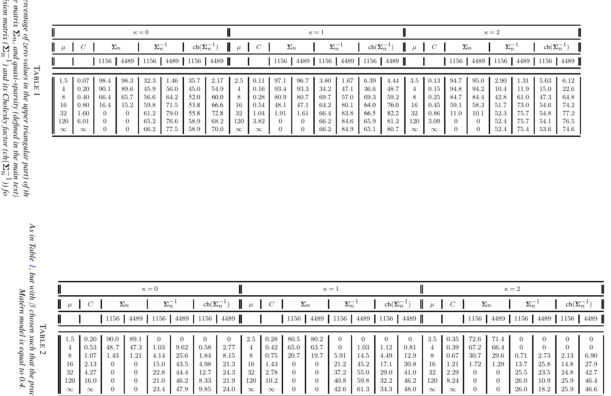

# ¿Son útiles las mejoras del modelo Matérn? {#sec7}

Esta sección final proporciona comentarios críticos sobre el modelo Matérn y las versiones mejoradas del modelo presentadas en la Sección [7](#surr).

## Generalización Rigurosa del Modelo Matérn

El modelo de Matérn no permite soporte compacto, efectos de agujero (oscilaciones entre valores positivos y negativos) a grandes distancias, o colas que decaen lentamente adecuadas para modelar dependencia de largo alcance. La mayoría de las mejoras de la sección [7](#surr) tienen como objetivo resolver este tipo de problemas; Aquí describimos cómo los modelos $\mathcal{GW}$ , $\mathcal{GH}$ y $\mathcal{CH}$ pueden verse como generalizaciones rigurosas del modelo de Matérn.

[23] han demostrado que el modelo Matérn es un caso límite de una versión reescalada del modelo ${\cal GW}$ . En particular han considerado el modelo $\widetilde{{\cal GW}}$ definido como

$$
\widetilde{{\cal GW}}_{\kappa,\mu,\beta}(x) = {\cal GW}_{\kappa,\mu,\beta \left(\frac{\Gamma(\mu+2\kappa +1)} {\Gamma(\mu)}\right)^{\frac{1}{1+2\kappa}}}(x), \qquad x \ge 0,
$$

y demostraron que

$$
\lim_{\mu\to\infty} \widetilde{{\cal GW}}_{\kappa,\mu,\beta}(x)={\cal M}_{\kappa+1/2,\beta}(x),\quad \kappa\geq 0,
$$

con convergencia uniforme sobre el conjunto $x\in (0,\infty)$ . Por lo tanto, el parámetro $\mu$ permite cambiar de modelos con soporte compacto a modelos con soporte global, y puede corregirse para garantizar matrices de correlación dispersas o puede estimarse en función del conjunto de datos. Sin embargo, esta equivalencia se aplica sólo a los parámetros de suavidad mayores o iguales a $1/2$ en el modelo Matérn, por lo que no se cubre el rango completo del parámetro de suavidad. Esto es desafortunado, ya que la dimensión fractal [una medida ampliamente utilizada de rugosidad de las trayectorias de muestra para series temporales y datos espaciales; 66] está completamente parametrizado utilizando el modelo Matérn cuando el parámetro de suavidad se encuentra entre $0$ y $1$ . Como consecuencia, el modelo ${\cal GW}$ (o $\widetilde{{\cal GW}}$ ) no puede parametrizar completamente la dimensión fractal del campo aleatorio. Este tipo de problema se puede resolver con el modelo $\mathcal{GH}$ , que incluye el modelo ${\cal GW}$ como caso especial [53]:

$$
\mathcal{GH}_{\frac{d+1}{2}+\nu,\frac{d+\mu+1}{2}+\nu,\frac{d+\mu}{2}+1+\nu,\beta}(x)= {\cal GW}_{\nu,\mu,\beta}(x)
$$

Dejar que $\beta$ , $\delta$ y $\gamma$ tiendan al infinito de tal manera que $\beta/\sqrt{4\delta\gamma}$ tiende a $\alpha>0$ , el modelo $\mathcal{GH}$ ([emery\]) converge uniformemente al modelo Matérn $\mathcal{M}_{\kappa-d/2, \alpha}(x)$ , y en este caso el *rango completo* del parámetro de suavidad del modelo Matérn es cubierto.

El modelo Matérn también surge como caso límite especial del modelo $\mathcal{CH}$ . Específicamente, [106] muestra que

$$
\lim_{\eta\to\infty} \mathcal{CH}_{\nu,\eta,2\sqrt{\nu(\eta+1)}\beta}(x)={\cal M}_{\nu, \beta}(x),
$$

tiene una convergencia uniforme en cualquier conjunto compacto.

El operador *banda giratoria* de [109] se puede aplicar a una función de correlación para crear efectos de agujero manteniendo la definición positiva del núcleo. Un argumento de Schoenberg demuestra que, para una correlación isotrópica en $\mathbb{R}^d$ , los valores de correlación no pueden ser menores que $-1/d$ [143]. Dado que el modelo Matérn es un modelo válido para todos los $d$ , esto implica que la aplicación de bandas giratorias al modelo Matérn no proporcionará ningún efecto de agujero. Por otro lado, los modelos ${\cal GW}$ y ${\cal GH}$ permiten tal efecto.

## Estimación de modelos mejorados {#estim}

La estimación de ML para el modelo de Matérn se comprende bien; Aquí discutimos hasta qué punto se pueden obtener resultados similares para mejoras del modelo Matérn.

En el contexto de asintóticas de dominio crecientes, los parámetros de los modelos ${\cal GW}$ y ${\cal CH}$ se pueden estimar consistentemente usando ML y se conoce la distribución asintótica asociada; consulte la sección [3.1.1](#ida).

En el contexto de asintóticas de dominio fijo, similar al modelo clásico de Matérn, los parámetros de estos modelos mejorados no se pueden estimar de manera consistente. Por ejemplo, [25] muestra que el parámetro microergódico del modelo de covarianza $\sigma^2{\cal GW}_{\kappa,\mu,\beta}$ , suponiendo que $\kappa$ y $\mu$ se conozcan, viene dado por $\mathrm{micro}_{{\cal GW}}= {\sigma^2}/{ \beta^{2 \kappa+1}}.$ . Además, demuestran que para un campo gaussiano de media cero definido en un conjunto infinito acotado $D\subset \mathbb{R}^d$ ( $d=1, 2, 3$ ), con el modelo de covarianza $\sigma^2_0{\cal GW}_{\kappa,\mu,\beta_0}$ , el estimador ML $\hat{\sigma}_{n}^{2}/\hat{\beta}_{n}^{2\kappa+1}$ del parámetro microergódico es fuertemente consistente, $i.e.$ ,

$$
\hat{\sigma}_{n}^{2}/\hat{\beta}_{n}^{2\kappa+1}\stackrel{a.s.}{\longrightarrow} \sigma_{0}^{2}/\beta_{0}^{2\kappa+1}.
$$

Además, para $\mu> (d+1)/2 +\kappa+ 3$ , es asintótico la distribución viene dada por

$$
\sqrt{n}(\hat{\sigma}_{n}^{2}/\hat{\beta}_{n}^{2\kappa+1}-\sigma_{0}^{2}/\beta_{0}^{2\kappa+1})\stackrel{d}{\longrightarrow} \mathcal{N}(0,2(\sigma_{0}^{2}/\beta_{0}^{2\kappa+1})^2).
$$

Los análogos para el modelo $\mathcal{GH}$ propuesto no están disponibles en este momento.

De manera similar, [106] muestra que el parámetro microergódico del modelo de covarianza $\sigma^2{\cal CH}_{\nu,\eta,\beta}$ , suponiendo que $\nu$ sea conocido, está dado por

$$
\mathrm{micro}_{{\cal CH}}= (\sigma^2 \Gamma(\nu+\eta))/ (\beta^{2 \nu}\Gamma(\eta)).
$$

. Además, prueban que para un campo gaussiano de media cero definido en un conjunto infinito acotado $D\subset \mathbb{R}^d$ ( $d=1, 2, 3$ ), con el modelo de covarianza $\sigma^2_0{\cal CH}_{\nu,\eta_0,\beta_0}$ , el estimador ML $(\hat{\sigma}_{n}^{2}/\hat{\beta}_{n}^{2\nu})(\Gamma(\nu+\hat{\eta}_n)/\Gamma(\hat{\eta}_n))$ del parámetro microergódico es fuertemente consistente, $i.e.$ ,

$$
\frac{\hat{\sigma}_{n}^{2} (\Gamma(\nu+\hat{\eta}_n) }{ \hat{\beta}_{n}^{2\nu} \Gamma(\hat{\eta}_n)}\stackrel{a.s.}{\longrightarrow} \frac{\sigma_{0}^{2}\Gamma(\nu+\eta_0)}{\beta_{0}^{2\nu} \Gamma(\eta_0)}
$$

y, si $\eta_0> d/2$ , su distribución asintótica viene dada por

$$
\begin{aligned}
& \hspace{-40pt} \frac{\hat{\sigma}_{n}^{2} (\Gamma(\nu+\hat{\eta}_n) }{ \hat{\beta}_{n}^{2\nu} \Gamma(\hat{\eta}_n)}-\ \frac{\sigma_{0}^{2}\Gamma(\nu+\eta_0)}{\beta_{0}^{2\nu} \Gamma(\eta_0)} \\
& \stackrel{d}{\longrightarrow} \mathcal{N}\left(0,2\left( \frac{\sigma_{0}^{2}\Gamma(\nu+\eta_0)}{\beta_{0}^{2\nu} \Gamma(\eta_0)}\right)^2 \right).
\end{aligned}
$$

Estos resultados respaldan ampliamente el uso de estimaciones del complemento ML para estas versiones mejoradas del modelo Matérn; La cuestión del rendimiento predictivo se analiza a continuación.

## Predicción con modelos mejorados

Si dos medidas gaussianas son equivalentes, entonces las predicciones asociadas y los errores cuadráticos medios son asintóticamente idénticos (consulte la sección [3.2](#pprr)). Con este fin, resultados recientes han buscado establecer equivalencia entre las medidas gaussianas para el modelo de Matérn y las mejoras del modelo de Matérn. [25] considere el modelo $\sigma_1^2{\cal GW}_{\kappa,\mu,\beta}$ y demuestre que para $\sigma_1 \geq 0$ , $\nu \geq 1/2$ y $\kappa \geq 0$ dados, si $\nu=\kappa+1/2$ , $\mu > d+ \kappa+1/2$ y

$$
\label{true}
\sigma_{0}^{2}\alpha^{-2\nu}=\left( \frac{\Gamma(2\kappa+\mu+1)}{\Gamma(\mu)} \right) \sigma_{1}^{2}\beta^{-(1+2\kappa)},
$$

entonces $P(\sigma^2_0{\cal M}_{\nu,\alpha})$ es equivalente a $P(\sigma^2_1{\cal GW}_{\kappa,\mu,\beta})$ , para $d=1,2,3$ , en los caminos de $Z(\boldsymbol{x})$ para $\boldsymbol{x} \in D \subset \mathbb{R}^d$ . Así, las predicciones realizadas utilizando el $\mathcal{GW}$ modelo con soporte compacto son asintóticamente idénticos a los realizados con el modelo Matérn. Asimismo,[106]demostrar que para un determinado $\eta\geq d/2$ y $\nu \geq 0$ , si

$$
\label{true2} 
\sigma_{0}^{2}\alpha^{-2\nu}=\left( \frac{\Gamma(\nu+\eta)}{\Gamma(\eta)} \right) \sigma_{1}^{2}\left(\frac{\beta^2}{2}\right)^{-\nu},
$$

entonces $P(\sigma^2_0{\cal M}_{\nu,\alpha})$ es equivalente a $P(\sigma^2_1{\cal CH}_{\nu,\eta,\beta})$ , para $d=1,2,3$ , en los caminos de $Z(\boldsymbol{x})$ para $\boldsymbol{x} \in D \subset \mathbb{R}^d$ . Así, las predicciones realizadas utilizando el $\mathcal{GW}$ El modelo con decaimiento de cola polinomial es asintóticamente idéntico a los realizados usando el modelo de Matérn.

Si el interés está en el predictor [blup\], pero no en la incertidumbre predictiva resultante del campo aleatorio gaussiano asociado, entonces es interesante observar que el supuesto de estacionariedad del modelo de Matérn puede no ser necesario. [153] demostró que, bajo condiciones paramétricas adecuadas, se puede considerar $\alpha=0$ en el modelo de Matérn, y esto es equivalente a la predicción usando los núcleos poliarmónicos $H_{\nu,d}$ en ([eqKmd\]). El teorema 1 de ese trabajo muestra que si $d\le 3$ y el parámetro $\nu$ satisfacen la condición (2) del mismo (o $d = 1$ ), entonces *es imposible distinguir $\alpha>0$ de $\alpha=0$ en un dominio acotado.* La observación anterior refleja el hecho de que la predicción utilizando poliarmónicos Los núcleos, como en la sección [6.1](#SecNAaAT), son independientes de la escala. Esto se deriva de la homogeneidad de la transformada de Fourier y elimina la necesidad de realizar una estimación de escala en este contexto.

## Apantallamiento con modelos mejorados

El efecto de cribado se extiende también a las versiones mejoradas del modelo Matérn. Para esquemas regulares, el Teorema 1 en [128] muestra que el modelo ${\cal GW}$ permite un efecto de apantallamiento asintótico cuando $\mu > (d+1)/2 +\kappa$ . Esta condición no es restrictiva, ya que $\mu \ge (d+1)/2 +\nu$ ya es necesario para que ${\cal GW}_{\kappa,\mu,\beta}$ pertenezca a la clase $\Phi_d$ . Para los esquemas irregulares la situación es más complicada. Por ejemplo, para campos no diferenciables en $d=1$ , el teorema $1$ en [151] junto con el teorema 1 en [128] explica que el modelo de Askey ${\cal GW}_{0,\mu,\beta}$ permite un efecto de apantallamiento proporcionado $\mu >1$ . Para $d=2$ , el teorema $2$ en [151] implica que el modelo Askey permite la detección siempre que $\mu>3/2$ . El modelo $\mathcal{GW}$ satisface la condición de Stein en (1.3) de [128], lo que a su vez permite verificar la hipótesis de Stein [\[condición1\]](#condición1).

Los experimentos numéricos en [128] sugieren que el efecto de apantallamiento es aún más fuerte en modelos mejorados con soporte compacto, en comparación con el modelo Matérn estándar. Esto puede ofrecer ventajas computacionales, que analizamos a continuación.

## Computación escalable {#big-data-comp}

La eterna lucha entre la precisión estadística y la escalabilidad computacional ha producido métodos que intentan abordar este notorio compromiso. La discusión que sigue se centra específicamente en esta compensación en el contexto del modelo Matérn. No se discutirán enfoques generales, como aquellos basados ​​en procesos predictivos [17] y aquellos basados ​​en kriging de rango fijo [45]; Se remite al lector interesado a la revisión de [154].

La complejidad computacional asociada con el modelo Matérn se rige en términos generales por la dimensión del espacio de entrada ( $d$ ), el número ( $p$ ) de parámetros del núcleo que deben estimarse y el número de datos ( $n$ ). Estos desafíos se considerarán uno por uno.

Primero, consideramos el desafío del $d$ grande, que a menudo se encuentra en el aprendizaje automático, cuando la regresión del proceso gaussiano se realiza en espacios de entrada de alta dimensión [169]. Dado que el modelo de Matérn ${\cal M}_{\nu,\alpha}$ reproduce un espacio de Sobolev hasta una norma equivalente (c.f. Sección [6.1](#SecNAaAT)), y se requiere que $\nu>d/2$ para que los elementos de este espacio estén bien definidos puntualmente, se deduce que $\nu$ debe tender al infinito como $d$ tiende a infinito, de modo que el modelo de Matérn se reduce al modelo gaussiano [eqGauLim\]. La flexibilidad de algunos modelos mejorados también se pierde en este límite; la condición $\mu \ge (d+1)/2+\kappa$ en el modelo $\widetilde{{\cal GW}}_{\kappa,\mu,\beta}$ obliga al parámetro $\mu$ a ir al infinito con $d$ , lo que a su vez obliga a $\widetilde{{\cal GW}}_{\kappa,\mu,\beta}$ a acercarse a ${\cal M}_{\nu,\alpha}$ . Desde este punto de vista, la clase $\mathcal{GH}_{\kappa,\delta,\gamma,\beta}$ parece más prometedora para usar en $d$ grandes. Una observación adicional es que, para $d \ge 5$ , todas las medidas gaussianas con funciones de covarianza de Matérn son ortogonales [8]. Esto tiene consecuencias filosóficas para la regresión del proceso gaussiano cuando el modelo de Matérn se ve como una distribución *previa* que codifica una creencia *a priori*, ya que un pequeño cambio en los parámetros del núcleo da como resultado que se cambie todo el soporte de la anterior.

Junto con la gran dimensión de entrada $d$ , está el desafío de que aparezca una gran cantidad de parámetros $p$ en el modelo. El modelo multivariado de Matérn sufre por el hecho de que $p$ no solo aumenta exponencialmente con $d$ , sino que las condiciones de validez del modelo implican severas restricciones en el coeficiente de correlación colocado $\rho_{ij}$ en ([stma\]). [54] muestran que tales restricciones ya se vuelven extremadamente severas con $p=3$ . Se aplican comentarios similares a otras funciones de covarianza multivariadas, incluido el modelo multivariado $\mathcal{GW}$ en [46].

Finalmente consideramos el caso donde el número $n$ de datos es grande, lo que implica un costo computacional $O(n^3)$ y un costo de almacenamiento $O(n^2)$ asociado con el predictor [blup\]. Se han propuesto varios enfoques para reducir estos costos en el contexto del modelo Matérn, muchos de los cuales aprovechan la dispersidad (aproximada) de la covarianza ( $\boldsymbol{\Sigma}_n$ ) o la precisión ( $\boldsymbol{\Sigma}_n^{-1})$ , o su factor de Cholesky ( $\text{ch}(\boldsymbol{\Sigma}_n^{-1}))$ :

- La dispersidad en la matriz de covarianza $\boldsymbol{\Sigma}_n$ del modelo Matérn es explotada directamente por versiones mejoradas del modelo Matérn de la Sección [7](#surr). Estos enfoques pueden resultar útiles cuando el soporte compacto (estimado) es relativamente pequeño con respecto a la extensión espacial de la región de muestreo, de modo que las aproximaciones son extremadamente dispersas; véase a continuación una investigación empírica de este punto.

- La matriz de precisión $\boldsymbol{\Sigma}_n^{-1}$ asociada con el modelo Matérn en general no es dispersa (excepto en el caso $d=1$ y $\nu=0.5$ ), pero resulta que los valores de la matriz en general son relativamente cercanos a $0$ , es decir, $\boldsymbol{\Sigma}_n^{-1}$ es *cuasidisparso*. Como consecuencia, aproximar $\boldsymbol{\Sigma}_n^{-1}$ con una matriz dispersa puede ser una buena estrategia. Un ejemplo notable de este enfoque es el enfoque SPDE de la Sección [4.2](#SecSPDE). Este enfoque también puede estar motivado a partir de resultados en álgebra lineal numérica, que demuestran que si los elementos de una matriz muestran una propiedad de desintegración, entonces los elementos de su inversa también muestran un comportamiento similar (y más rápido) [20].

- La aproximación de Vecchia [163] y sus extensiones [48; 67; 83; 47] implican una dispersa aproximación de $\text{ch}(\boldsymbol{\Sigma}_n^{-1})$ y a menudo se aplican al modelo de Matérn, aunque se pueden aplicar a cualquier modelo de covarianza. Una posible limitación de estos métodos es que dependen del orden de las variables y de la elección de conjuntos de condicionamiento que determinan el patrón de dispersidad de Cholesky [67].

{#fig-tablas width=100%}

Es instructivo investigar numéricamente la dispersidad de matrices asociadas con mejoras del modelo Matérn, y para ello nos centramos en el modelo $\widetilde{{\cal GW}}_{\kappa,\mu,\beta}$ , que nos permite pasar de un modelo con soporte compacto de radio

$$
C=
\beta \left(\frac{\Gamma(\mu+2\kappa +1)} {\Gamma(\mu)}\right)^{\frac{1}{1+2\kappa}}
$$

al modelo Matérn aumentando la $\mu$ parámetro. En nuestro experimento, la dispersidad de $\boldsymbol{\Sigma}_n$ y la *casi-dispersidad* de $\boldsymbol{\Sigma}_n^{-1}$ y $\text{ch}(\boldsymbol{\Sigma}_n^{-1})$ se informan, este último se define como el porcentaje de valores en la matriz triangular superior con un valor absoluto inferior a una constante pequeña arbitraria $\epsilon$ , y en nuestro ejemplo establecemos $\epsilon=1.e-8$ .

La evaluación empírica considera los sitios de ubicación $n=1,156$ y $n=4,489$ sobre $[0,1]^2$ , donde los puntos están igualmente espaciados por $0.03$ y $0.015$ respectivamente en una cuadrícula regular. Para $\nu=0,1,2$ , configuramos $\beta$ de modo que el rango práctico del modelo Matérn sea igual a $0.15$ ( $\beta=0.050, 0.0316, 0.0253$ respectivamente) y consideramos aumentar $\mu=1.5+\kappa,4, 8, 16, 32, 120, \infty$ (siendo $\widetilde{{\cal GW}}_{\kappa,\infty,\beta}$ el modelo Matérn ${\cal M}_{\kappa+1/2,\beta})$ ).

Los resultados se informan en la Tabla [tab2222\]. Para los valores bajos $\mu=1.5, 2.5, 3.5$ y $\nu=0, 1, 2$ , la matriz de covarianza es muy dispersa, mientras que la dispersidad disminuye al aumentar $\mu$ , como se esperaba. Existe una clara compensación entre la dispersidad de $\boldsymbol{\Sigma}_n$ y la cuasi dispersidad de $\boldsymbol{\Sigma}_n^{-1}$ y $\text{ch}(\boldsymbol{\Sigma}_n^{-1})$ para cada $\nu=0, 1, 2$ . Sin embargo, cuando se aumenta $\mu$ , es decir, cuando $\boldsymbol{\Sigma}_n$ se acerca a la matriz de covarianza de Matérn, entonces $\boldsymbol{\Sigma}_n^{-1}$ o $\text{ch}(\boldsymbol{\Sigma}_n^{-1})$ tienden a ser muy dispersos.

Replicamos el mismo experimento pero con un alcance práctico del modelo Matérn igual a $0.4$ . Esto lleva a $\beta=0.133, 0.084, 0.067$ para $\nu=0, 1, 2$ respectivamente. Los resultados se informan en la Tabla [tab333\]. Las conclusiones son las mismas que en la configuración anterior, pero en este caso tenemos niveles más bajos de dispersidad para $\boldsymbol{\Sigma}_n$ y de cuasi dispersidad para $\boldsymbol{\Sigma}_n^{-1}$ y $\text{ch}(\boldsymbol{\Sigma}_n^{-1}$ .

Estos experimentos numéricos resaltan una clara compensación entre la (casi) dispersidad de $\boldsymbol{\Sigma}^{-1}_n$ (o $\text{ch}(\boldsymbol{\Sigma}_n^{-1})$ ) y $\boldsymbol{\Sigma}_n$ al aumentar $\mu$ para $\beta$ y $\nu$ fijos, es decir, al cambiar de un soporte compacto a un Modelo Matérn apoyado globalmente. En particular, cuando $\mu \to \infty$ (el modelo Matérn), entonces $\boldsymbol{\Sigma}_n^{-1}$ es muy cuasi-disperso y $\boldsymbol{\Sigma}_n$ es denso. Por el contrario, cuando $\mu$ es pequeño, entonces $\boldsymbol{\Sigma}_n^{-1}$ no es casi disperso, pero $\boldsymbol{\Sigma}_n$ es muy disperso. Esto parece sugerir que la aproximación matricial de dispersa precisión debería funcionar razonablemente bien para el modelo de Matérn, pero podría ser problemática cuando se manejan datos que exhiben una dependencia corta y con soporte compacto. En este caso, un mejor enfoque debería ser explotar la dispersidad de $\boldsymbol{\Sigma}_n$ , como lo permiten las versiones mejoradas del modelo Matérn.

# Conclusión

El impacto del modelo Matérn desde su concepción ha sido sustancial y el modelo sigue utilizándose ampliamente en una amplia gama de disciplinas científicas y más allá. Si bien la motivación original para el modelo de Matérn provino de su flexibilidad en el contexto de la interpolación espacial, ahora también existe una rica literatura sobre versiones alternativas y mejoradas del modelo. En particular, el SPDE y enfoques relacionados permiten definir análogos del modelo de Matérn en dominios bastante generales, admitiendo dispersas aproximaciones a matrices de precisión, mientras que los avances recientes en modelos mejorados con soporte compacto pueden facilitar el cálculo escalable a través de aproximaciones dispersas de matrices de covarianza, y son adecuados para procesos con dependencia de corta escala. Las propiedades teóricas y empíricas de estos modelos mejorados se han estudiado recientemente y activamente. Por otro lado, quedan abiertas cuestiones teóricas de importancia práctica, como la estimación de parámetros en tamaños de muestra finitos y el impacto de la estimación de parámetros en el desempeño de las predicciones asociadas.

Nuestra comprensión actual del modelo Matérn ha surgido como resultado del compromiso entre científicos y profesionales de diferentes disciplinas, y nuestra esperanza es que esta perspectiva multidisciplinaria arroje más luz sobre el modelo Matérn.
